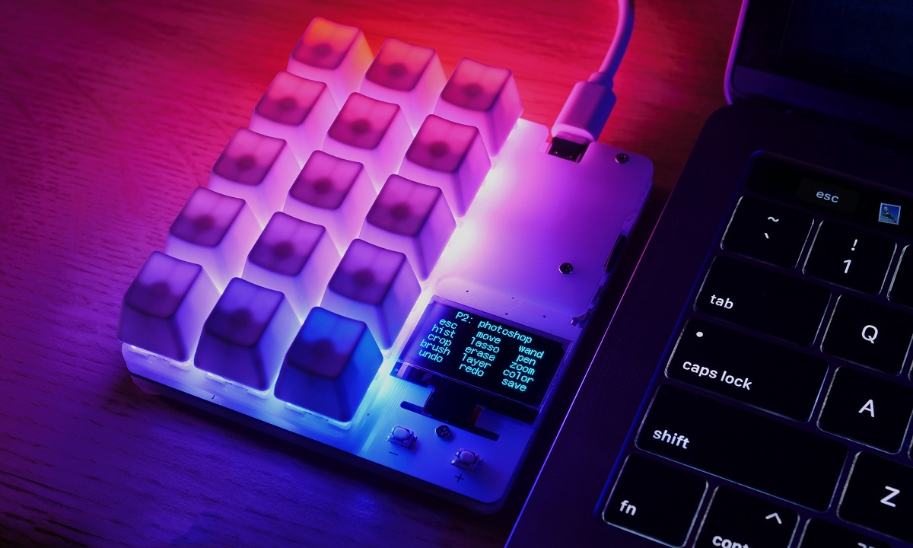

# duckyPad: DIY可编程快捷小键盘

----
donkeyPad 是一个15键的机械键盘, 一键代替普通键盘的组合键或一连串鼠键输入，来加速你的工作。

这款键盘的原作者是dekuNukem,采用MIT开源许可，但中文资料是空白, 这个版本库用于补充相关中文资料。dapengLab出品的duckyPad硬件有所改动, 软件与原版保持兼容。

duckyPad 采用时尚的设计，具有所有高端机械键盘的优点:

* 机械按键
* **轴体热插拔**
* **RGB背光**
* **USB-C**
* 开源

但更重要的是, duckyPad 还具有以前在宏键盘中从未见过的创新，例如:

* **OLED** 屏幕显示每个按键的功能
* 复杂的多行脚本 (TODO：链接到脚本说明文档)
* 32页, 每页15条宏, 一共480条宏
* 根据激活的窗口，**自动换页**(TODO:链接到说明文档)
* TF存储, 换到另一个键盘上，宏不丢失
* 不需要安装驱动, 任何支持USB键盘的设备都能用

这个脚本可以像快捷键这么简单 `Control + C`, 也可以稍复杂一点像启动一个应用, 也可以将多个动作连起来一键触发，各个动作间还能加以时间和循环相关处理。理论上这个键盘做的事, 用普通鼠键也能完成，但可能要按千万个键。

## 特点

### 轴体

Cherry MX 兼容轴体。

### 键帽

当然，键帽也可以自己换

### 热插拔 插座

duckyPad 采用 Kailh（凯华）热插拔 插座。更换轴体非常方便，不需要工具。

### RGB 背光灯

每一个按键都有独立的RGB背光灯，都可以在宏中独立控制，能调出需要的颜色。

### OLED 屏幕

duckyPad 有一块OLED屏，可以显示当前的页，每一个按键的功能提示。

* 1.3寸 OLED 屏
* 128 x 64 分辨率
* 程序有防烧屏设计

目前只支持英文显示，如果要显示中文，这块屏就太小了。
是否有必要用更大的屏来显示中文这个问题还需要讨论。

### duckyScript

duckyPad 使用 [duckyScript](duckyscript_info.md)来编程，使用很简单的，但功能可以很强大。

