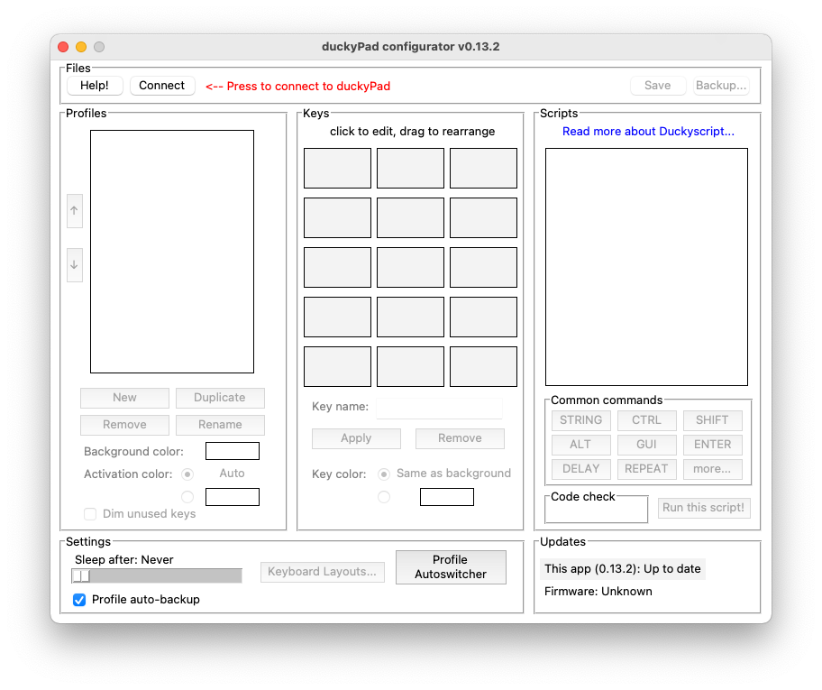
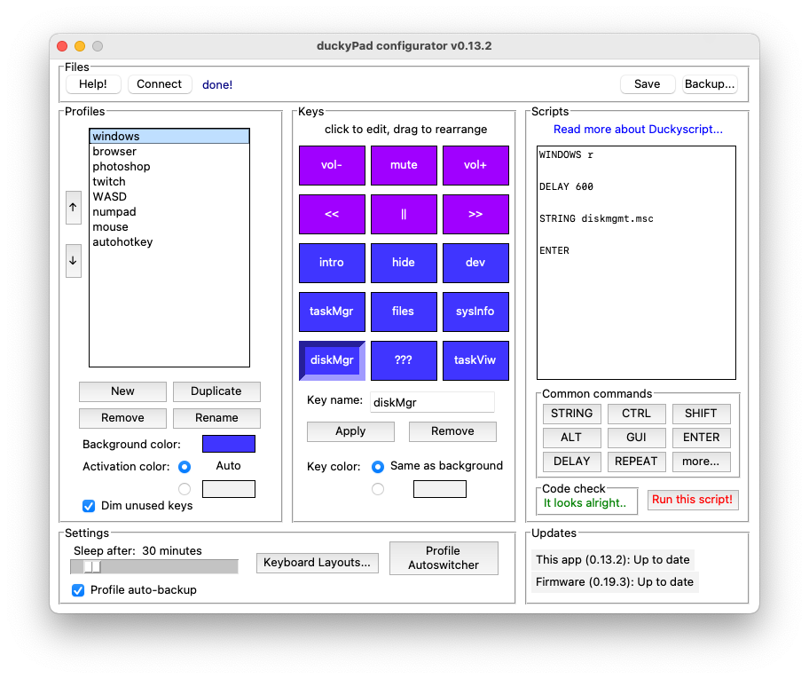
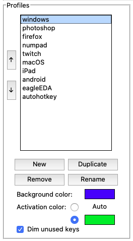
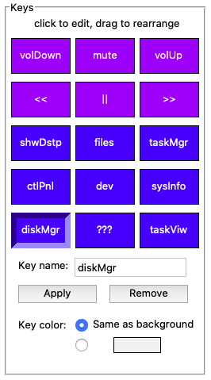
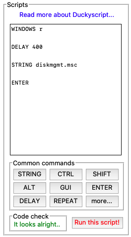
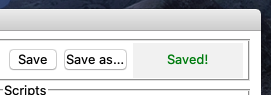

# duckyPad快速上手

祝贺你的新玩具到手，这里是duckyPad的快速上手指南

## 快速开始

如果你的Pad是从dapengLab买的，默认是安装好TF卡的，里面有示例配置文件，到手接上电脑就可以体验，默认有媒体，浏览器，photoshop，操作系统相关的控制功能等。

* 按下一个键执行对应的脚本程序
* 按屏幕下方的 ‘+’ 和 ‘-’ 来切换页
* 按住 ‘+’ 不松，进入快速换页界面
* 按住 ‘-’ 不松，进入亮度调节界面
* 按住左上角的键，再插USB，可以进入键盘布局选择界面

## 求助，我的Pad不工作了

如果你使用的是AMD主板，可能会遇到USB芯片组bug，尝试更新芯片组驱动，换不同的USB口和USB Hub

## 自己配置duckyPad

如果默认的配置文件都体验过了，还是不过瘾，现在就可以自己配置Pad了，这是duckyPad真正强大的地方。

有两种方式可以配置它，一种是用配套的桌面端软件，另一种只需要电脑自带的记事本直接写配置文件。

### 下载 duckyPad Configurator
[下载桌面端配置软件](配置软件)

解压`.zip文件`，双击`duckypad_config.exe`运行

### 使用 duckyPad Configurator

启动后的界面

确保现在duckyPad是连上电脑的，点击左上角的`connect`连接，连上后界面是这样的：

### Profiles 页

* 最左边的一栏profiles，中文我翻译成页
* 每一页都有名字，这个名字会显示在OLED屏顶栏
* 每一页都包含一组脚本程序，并与每一个按键对应。
* 像上边看到的一样，我们一般为每一个软件创建一页，就起个分类的作用。
* 页下方有四个按键，可以新建，副本，删除，重命名页。
* 更下方就是这一页的默认灯光控制

### keys 按键

按键栏

* 现在左栏选中要编辑的页，再编辑这一页的15个按键
* 点击可编辑，拖拽可重新排列
* key name 就是按键的名字，会显示在OLED屏幕上
* 最下边是颜色选择，可以为一个按键设置特定的颜色，或则用这一页的默认颜色。

### Scripts 脚本程序

脚本程序栏

* 当你选择一个按键，他要执行的脚本程序就是这里显示的
* duckypad 采用的是 duckyScript，有专门的一个文档待补充。

### 别忘记保存

按`Save`保存
